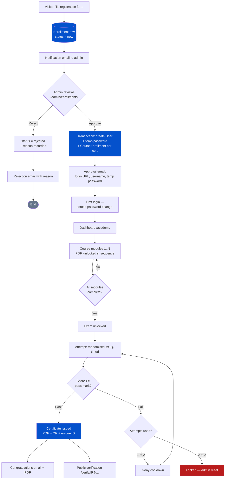
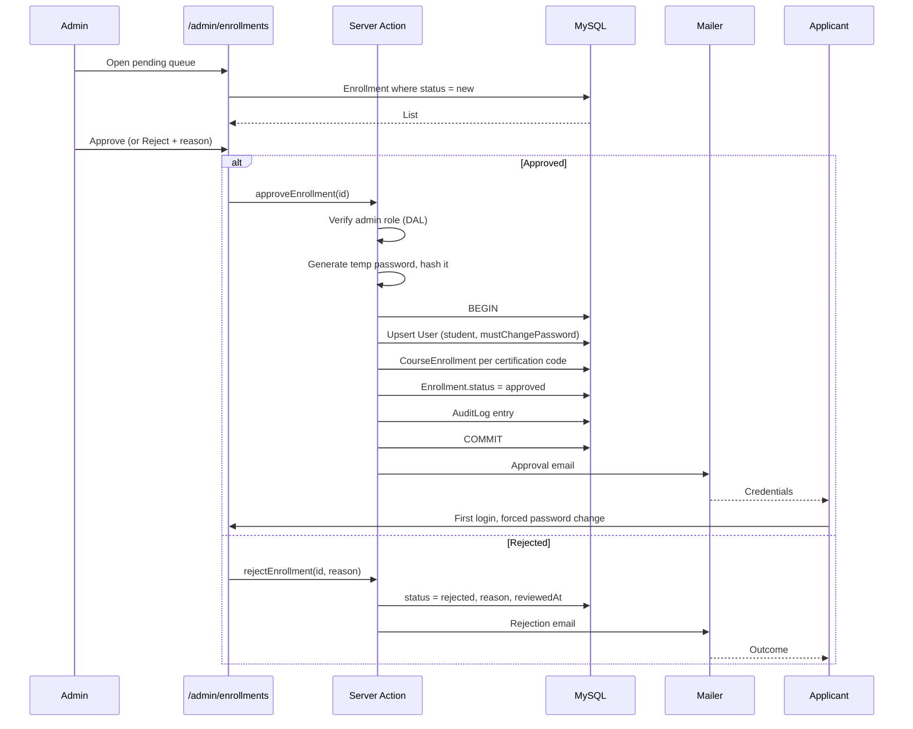
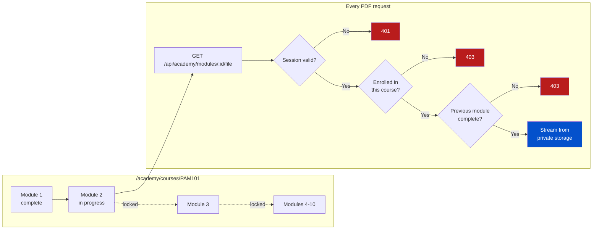
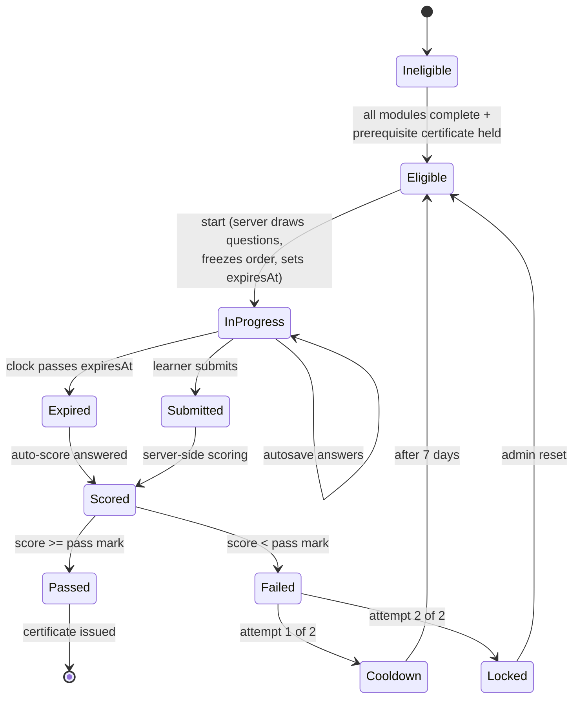
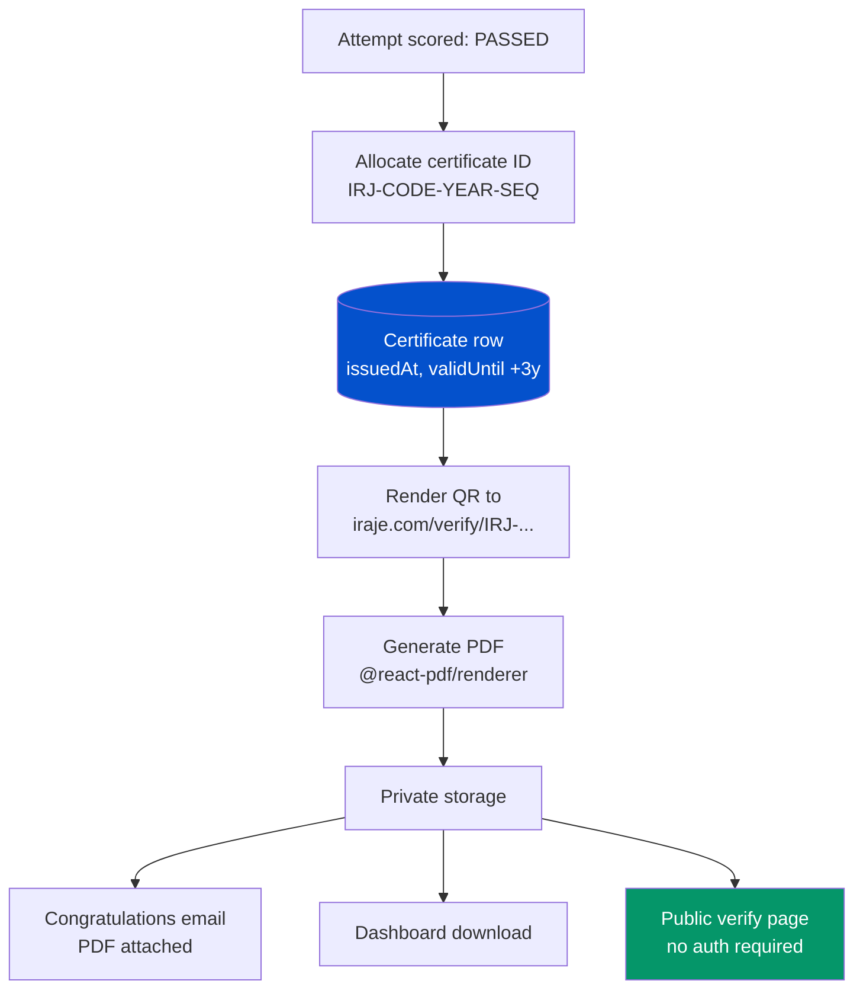
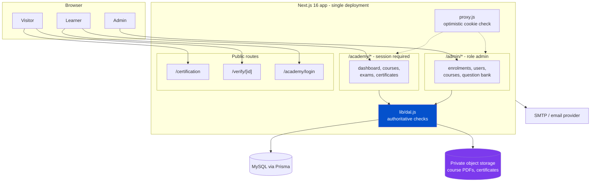
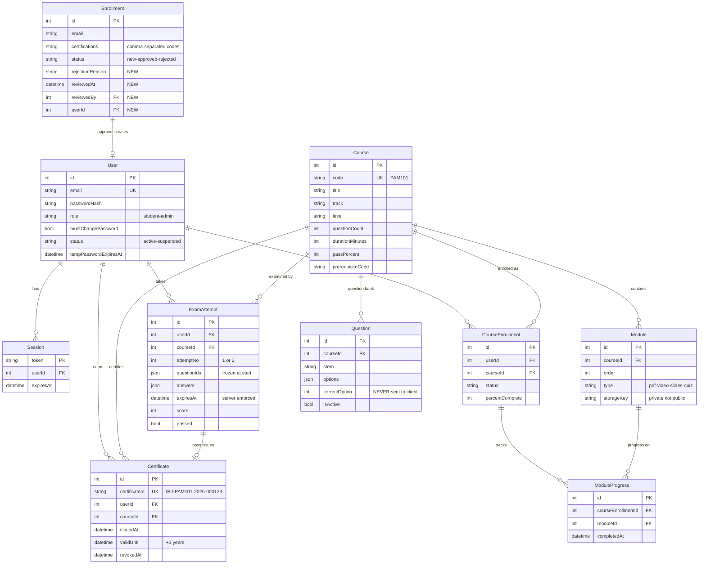

# Iraje University — Certification Platform Architecture

**Status:** Proposal · **Date:** 2026-08-20 · **Scope:** the `/certification` page and the learning platform behind it

This describes how the five-phase journey already advertised on the Certification page — **Register → Approval → Learn → Exam → Certificate** — becomes a working system.

---

## 1. What exists today

The Certification page is currently **marketing only**. It describes the product in detail, but nothing behind it is functional except registration.

| Piece | File | State |
|---|---|---|
| Marketing sections (9) | `src/components/Certification/*.jsx` | Built |
| Page content / copy | `src/data/certification.js` | Built |
| Registration form | `CertEnroll.jsx` | Built |
| Registration API | `src/app/api/enroll/route.js` | Built — saves + emails |
| `Enrollment` table | `prisma/schema.prisma` | Built |
| Approval, login, courses, exams, certificates | — | **Does not exist** |

Phase 1 (Register) is ~80% done. Phases 2–5 are greenfield.

Critically, the marketing copy makes **specific public promises** this architecture must honour:

- Exam format per certification (50 MCQ / 60 min / 70% for 101; 75 MCQ / 90 min / 75% for 201)
- Question banks of 500+ per track, randomised, auto-graded
- "Retake available after 7 days if not passed"
- Certificate IDs shaped `IRJ-PAM101-2026-000123`, with QR code and public validation URL
- 3-year certificate validity
- An approval email carrying "login URL, username and a temporary password"
- A dashboard at `academy.iraje.com/dashboard`

---

## 2. The journey



---

## 3. Phase 1 — Register

**Already built.** The form posts to `/api/enroll`, which rate-limits, checks a honeypot, validates, writes an `Enrollment` row, then emails the team. Keep it: the enrolment record is the *request*, not the account.

Two fixes before this carries real traffic:

1. **Database errors leak to the client.** `route.js` returns `error: "... ${err}"` plus `detail` and `code` — Prisma internals exposed to anyone who can POST. The code's own comment flags this. Gate it behind `process.env.NODE_ENV !== "production"`.
2. **Certification codes are inconsistent** (see §9). They become foreign keys here, so fix before more data accumulates.

---

## 4. Phase 2 — Approval

The pivot of the whole system: an admin decision converts a *request* into an *account*.



### Design decisions

**Account creation is transactional.** User, course enrolments and status change commit together or not at all — a half-approved applicant with a login but no courses is the worst outcome.

**Email is not inside the transaction.** Commit first, then send. If SMTP fails the approval still stands and the email can be re-sent from the admin screen — matching how `/api/contact` and `/api/enroll` already treat mail as best-effort.

**Temporary password.** Random 16+ chars from a CSPRNG, bcrypt-hashed before storage, never logged. `mustChangePassword` forces a reset at first login, and it carries an expiry (say 14 days) after which an admin must re-issue.

> **Security note:** a one-time *set-password link* is meaningfully safer than emailing a password — mail is plain text and lives in inboxes indefinitely. The marketing copy promises "username and a temporary password", so that is what this specifies, but the link approach is worth reconsidering before launch, since copy can still change.

**Re-approval is idempotent.** Approving twice must not create a second user or reset an active learner's password. Guard on `Enrollment.status` and a unique `User.email`.

---

## 5. Phase 3 — Learn

Courses are sets of 8–10 PDF modules, unlocked strictly in order.



### PDFs must never live in `public/`

Anything in `public/` is served to the entire internet at a guessable URL and gets indexed by search engines. Paid course material cannot go there. Instead:

- Store in **private object storage** (S3 / Cloudflare R2 / Azure Blob). Not the local filesystem — the build note in `package.json` indicates Vercel, where the filesystem is ephemeral and read-only.
- Serve **only** through `/api/academy/modules/[id]/file`, which re-checks session → enrolment → sequence on every request, then streams the bytes.
- Send `Cache-Control: private, no-store` and `Content-Disposition: inline`.
- Optionally stamp each page with the learner's email — a cheap deterrent against re-sharing.

Signed time-limited URLs are cheaper at scale but remain shareable for their lifetime. Stream through the route until bandwidth actually becomes a problem.

### Completion and unlocking

A module completes when the learner reaches the last page and clicks **Mark complete** (`POST /api/academy/modules/[id]/complete`). The server records `ModuleProgress`, then recomputes the course percentage.

**The sequence rule is enforced server-side, in the file route** — not merely by greying out links in the UI. A locked module must 403 even when requested directly.

### Module types

The marketing copy promises videos, presentations and knowledge checks alongside PDFs. Ship PDFs first, but give `Module` a `type` column (`pdf | video | slides | quiz`) from day one so the rest slot in without a migration.

---

## 6. Phase 4 — Exam



### Integrity rules

These are what make the exam meaningful. Every one is enforced server-side:

| Rule | Implementation |
|---|---|
| Answers never reach the browser | The question API returns stem + options only. `correctOption` never leaves the server. |
| Every test is different | The server samples N questions from the bank at start and stores the ordered IDs on the attempt. |
| Refresh doesn't reshuffle | The frozen ID list on the attempt row is replayed. |
| The timer can't be cheated | `expiresAt` is set server-side at start; submissions after it are scored as expired. The client countdown is cosmetic. |
| Progress survives a crash | Answers autosave per question. |
| Scoring is authoritative | Computed from the database on submit. The client is never trusted with a score. |

### Rules come from data, not code

Question count, duration and pass mark are already specified per certification in `src/data/certification.js`. Move them into the `Course` table so the exam engine reads one source of truth.

### The word "proctored"

The page says "proctored" three times. Real proctoring — webcam capture, screen lock, identity verification — is a substantial product in its own right, normally a third-party service (Proctorio, Talview). **V1 delivers randomisation, server-enforced timing, a single active attempt and tab-blur logging — not true proctoring.** Either soften the copy or budget for it separately. This is the largest gap between what the page promises and what a first build realistically ships.

### Retake policy

Published copy says "retake available after 7 days"; the requirement is "one more attempt". These combine cleanly: **maximum 2 attempts, the second unlocked 7 days after the first failure.** A second failure locks the course pending an admin reset.

---

## 7. Phase 5 — Certificate

On a pass, issuance runs automatically in one transaction:



**ID allocation must be race-safe.** `IRJ-PAM101-2026-000123` embeds a per-course, per-year sequence. Two simultaneous passes reading `COUNT(*) + 1` will collide. Use a dedicated counter row updated inside the transaction, plus a `UNIQUE` constraint on `certificateId` as a backstop.

**PDF generation:** `@react-pdf/renderer` — composes in React, runs serverless, needs no headless Chromium. Avoid Puppeteer here; it is heavy and awkward to deploy.

**Verification is public and read-only.** `/verify/[certificateId]` needs no login — that is the entire point, employers use it. Return only holder name, certification, issue date, validity and status. Never expose email, phone or employer. Rate-limit it with the existing `createRateLimiter` so it cannot be scraped to enumerate certificate holders.

The page also promises lookup **by candidate email**. Treat that carefully: it lets anyone test whether a given person holds a certificate. Make it confirm-only (never list), and rate-limit it.

**Revocation:** keep a `revokedAt` column. Certificates issued in error need to be withdrawable, and the verify page must say so.

---

## 8. System architecture



**One app, not two.** The copy advertises `academy.iraje.com`, but a separate deployment would duplicate Prisma, the mailer, validation and the design system. Build it as `/academy/*` inside this app; if the subdomain is wanted later, point it at the same deployment and rewrite in `proxy.js`. One codebase, one deploy, one session cookie.

### Authentication — built for Next.js 16

This repo runs Next 16, where **Middleware is renamed to Proxy** (`proxy.js` at the project root, exporting `proxy`). The design follows Next's own current guidance:

| Layer | Role |
|---|---|
| `proxy.js` | **Optimistic only.** Reads the session cookie and redirects obviously-logged-out users. No database calls — it runs on every request, including prefetches. |
| `lib/dal.js` | **Authoritative.** `verifySession()` wrapped in React `cache()`, called by every page, Server Action and route handler that touches protected data. |
| Route handlers | Re-check on every request. Never assume the proxy ran. |

Next's guidance is explicit that Proxy "should not be used as a full session management or authorization solution" — the real checks belong beside the data.

**Sessions:** an opaque random token in an `httpOnly`, `secure`, `sameSite=lax` cookie, backed by a `Session` table. Database-backed rather than stateless JWT so sessions are **revocable** — needed when an admin suspends an account or a learner is caught sharing material. Note that `cookies()` is async in this version: `(await cookies()).get('session')`.

**Passwords:** bcrypt (cost 12) via `bcryptjs`. Never store or log plaintext.

**Roles:** `student | admin` on `User`, checked in the DAL, not just the proxy.

---

## 9. Data model



The existing `Enrollment` and `Contact` tables keep their shape — `Enrollment` gains four columns and remains the record of the *request*. Everything else is new.

### Fix the certification codes first

`src/data/certification.js` uses **three different identifiers for the same two certifications**:

| Location | Value |
|---|---|
| `tracks[2].levels[].code` | `CT 101`, `CT 201` |
| `enroll.certStep.options[].code` | `CyberTantra 101`, `CyberTantra 201` |
| `tracks[2].levels[1].prerequisite` | `CyberTantra 101` |

`/api/enroll` stores whatever `certStep` says, so the database is accumulating `"CyberTantra 101"` while the tracks section calls the same thing `CT 101`. Once codes become foreign keys and prerequisite lookups, this breaks silently. **Pick one canonical code** — recommend `PAM101`, `PAM201`, `EPM101`, `EPM201`, `CT101`, `CT201` (no spaces, URL-safe) — and derive display names separately.

---

## 10. Route map

| Route | Access | Purpose |
|---|---|---|
| `/certification` | Public | Marketing (exists) |
| `/verify/[certificateId]` | Public | Certificate verification |
| `/academy/login` | Public | Learner sign-in |
| `/academy` | Student | Dashboard — progress, eligibility |
| `/academy/courses/[code]` | Student | Module list with lock state |
| `/academy/courses/[code]/modules/[n]` | Student | PDF viewer |
| `/academy/exams/[code]` | Student | Exam runner |
| `/academy/certificates` | Student | Downloads |
| `/admin/enrollments` | Admin | Approve / reject queue |
| `/admin/courses/[code]/modules` | Admin | Upload PDFs |
| `/admin/questions` | Admin | Question bank |
| `POST /api/enroll` | Public | Registration (exists) |
| `POST /api/academy/login` | Public | Create session |
| `GET /api/academy/modules/[id]/file` | Student | **Authorized PDF stream** |
| `POST /api/academy/modules/[id]/complete` | Student | Mark complete, unlock next |
| `POST /api/academy/exams/[code]/start` | Student | Draw questions, start clock |
| `POST /api/academy/exams/[id]/submit` | Student | Score, maybe issue certificate |
| `GET /api/academy/certificates/[id]/pdf` | Student | Download |

---

## 11. Blocking dependency: outbound email

**Every phase transition in this system is an email.** Approval credentials, rejection reasons, exam results, certificate delivery. If mail does not send, an approved learner never learns they were approved and never receives a password. There is no in-app fallback, because the account does not exist until approval.

As of today, **outbound mail is completely blocked**. Microsoft 365 rejects the login for `inquiry@iraje.com`:

```
535 5.7.139 Authentication unsuccessful,
SmtpClientAuthentication is disabled for the Tenant.
```

Contact and enrolment notifications have never been delivered.

This must be resolved before Phase 2 can ship. Either an M365 admin enables SMTP AUTH for that mailbox, or — better for a system now sending transactional mail with PDF attachments — move to a transactional provider (Brevo, Resend, SendGrid) with `iraje.com` verified via SPF/DKIM. `src/lib/mailer.js` needs no code change, only credentials.

The same discipline as elsewhere in this codebase applies: **commit the state change first, send the email second, and record whether it sent** — so failures are visible and re-sendable rather than silent.

---

## 12. Build sequence

| Phase | Deliverable | Depends on |
|---|---|---|
| **0** | Fix certification codes; stop leaking DB errors; **restore email** | — |
| **1** | Auth: `User`, `Session`, login, `proxy.js`, `lib/dal.js`, forced password change | 0 |
| **2** | Admin approval queue; approve / reject with email | 1 |
| **3** | Course + Module model; admin PDF upload; private storage | 1 |
| **4** | Learner dashboard; sequential unlock; progress tracking | 2, 3 |
| **5** | Question bank admin; MCQ import | 3 |
| **6** | Exam engine: start, autosave, submit, score, retake rules | 4, 5 |
| **7** | Certificates: ID allocation, PDF, QR, email, public verify | 6 |
| **8** | Hardening: rate limits, audit log, revocation, watermarking | 7 |

Phases 1–2 alone deliver visible value: approvals stop being manual and applicants get answers.

---

## 13. Decisions to confirm

1. **Proctoring** — soften the copy, or budget for a third-party proctoring service?
2. **Credentials by email** — temp password as promised, or the safer one-time set-password link?
3. **Storage** — which provider for private PDFs? (R2 is cheapest for egress; S3 most familiar.)
4. **Subdomain** — is `academy.iraje.com` a hard requirement, or will `iraje.com/academy` do for v1?
5. **Certificate validity** — the sample shows 3 years. Does expiry mean re-examination?
6. **Question bank** — 500+ per track is advertised. Who authors them, and in what import format?
7. **Retake fee** — free, as currently implied?
